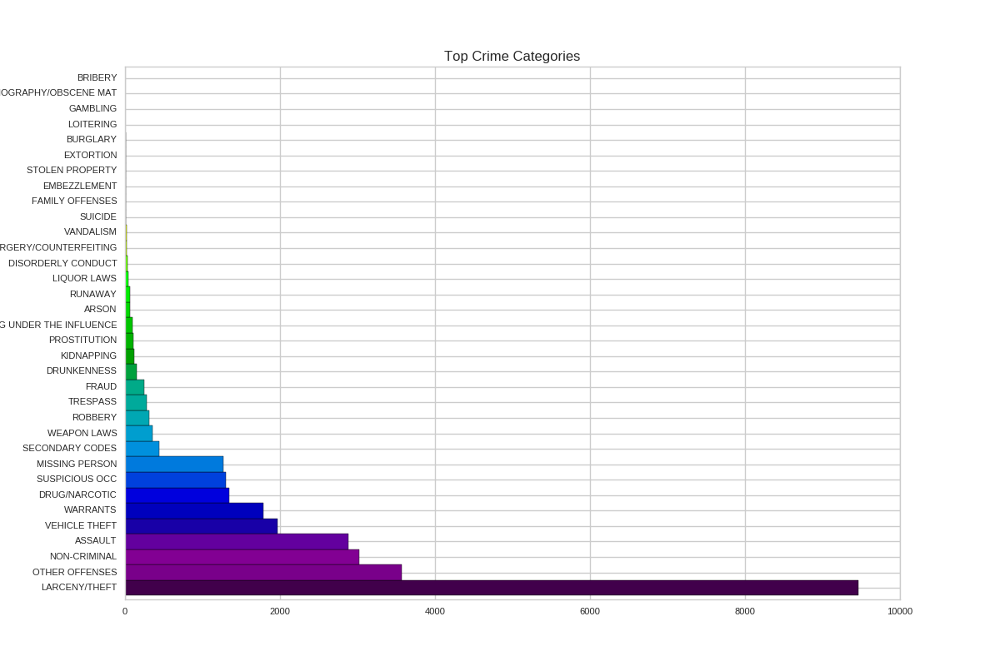

In this assignment, we are trying to analyze crime occured in San Francisco durring the summer 2014.

We will show that the crimes occure mostly during the evening and that most of the crimes belong to the category **LARCENY/THEFT**. Moreover, we will show that this type of crime is mostly occuring in a certain neighboorhood.

Let's start to look at the time distribution of the crimes.  

Here, we plotted the number of crimes per day. we can see that there is a slight increase of crimes during the week end but less than what we were expecting. However, if we plot the crime distribution on each hour of a week (Monday 00:00 being 0, Monday 01:00 being 1 , Tuesday 00:00 being 24, ...) we can 
clearly see that most of the crimes are occuring during the afternoon/evening!

We can also try to see if some neighboorhood are more dangerous than others in San Francisco.

This map show us that crimes are concentrated in a central area with some other spots in the city.

Now, let's look at the top crime categories

We can see that the top crime here is **LARCENY/THEFT** by a huge margin so let's focus on it.
First, let's try to see in which areas is this crime occuring.

We can observe that this crime is really concentrated in one neighboorhood, even more that the first map.

Now let's see if this type of crime is more occuring at some hours or during some days:
 
On the first figure, as opposed to when we were considering all the crimes, we can clearly see that there is an increase of *Larceny/Theft* crimes during Friday and the Week end. Moreover, the second figure tell us that most of the crimes are occuring during the afternoon. Lastly, we can also notices that there is a decrease of crime everyday just after lunch. Maybe it's nap time?

To finish, let's look at the crime distribution over the city if we exclude this *Larceny/Theft* category.

